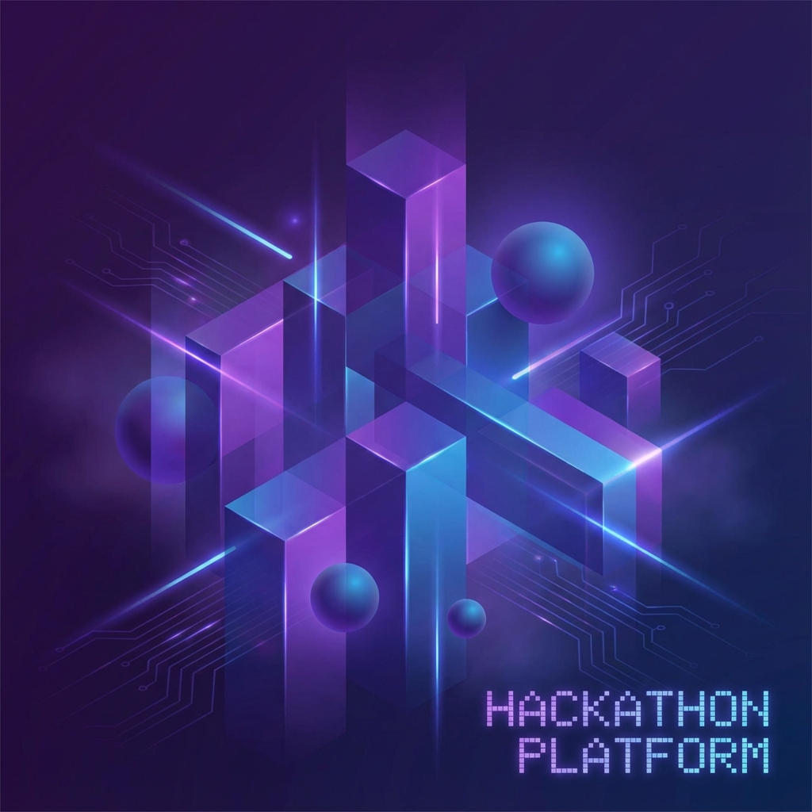

# Hi there, I'm Sarvesh 👋

> **Full Stack Developer** crafting high-performance, pixel-perfect web experiences.

I specialize in building scalable web applications with a focus on modern design, interactivity, and speed. My portfolio showcases a range of projects from immersive 3D web platforms to enterprise-grade dashboards.

## 🛠 Tech Stack

-   **Frontend**: React, Next.js, TypeScript, Tailwind CSS, Framer Motion, Three.js
-   **Backend**: Node.js, Express, PostgreSQL, Firebase
-   **Mobile**: React Native, Expo
-   **Tools**: Git, Vercel, Figma

## 🚀 Selected Projects

### [Ideayaan Studio](https://github.com/ideayaan-stack/studio)
*Immersive 3D Hackathon Platform*
-   Built with **React**, **Three.js**, and **Vite**.
-   Features smooth 3D scene traversal and optimized asset loading.

### [Orbital Flow](https://github.com/Sarvesh2005-code/Orbital-Flow)
*Productivity Workflow Automation*
-   Complex node-based editor using **React Flow**.
-   **Next.js** architecture for server-side performance.

### [Synk](https://github.com/Sarvesh2005-code/Synk)
*Real-time Synchronization Engine*
-   High-concurrency backend with **WebSockets** and **Node.js**.
-   < 50ms latency for collaborative editing.

### [ITMS Dashboard](https://github.com/Sarvesh2005-code/itms-dashboard)
*Enterprise Management System*
-   Data-rich dashboard using **Tremor** charts.
-   Secured with **NextAuth** and **PostgreSQL**.

## 🌐 Connect

---

© 2025 Sarvesh Dadarao Nakhale
